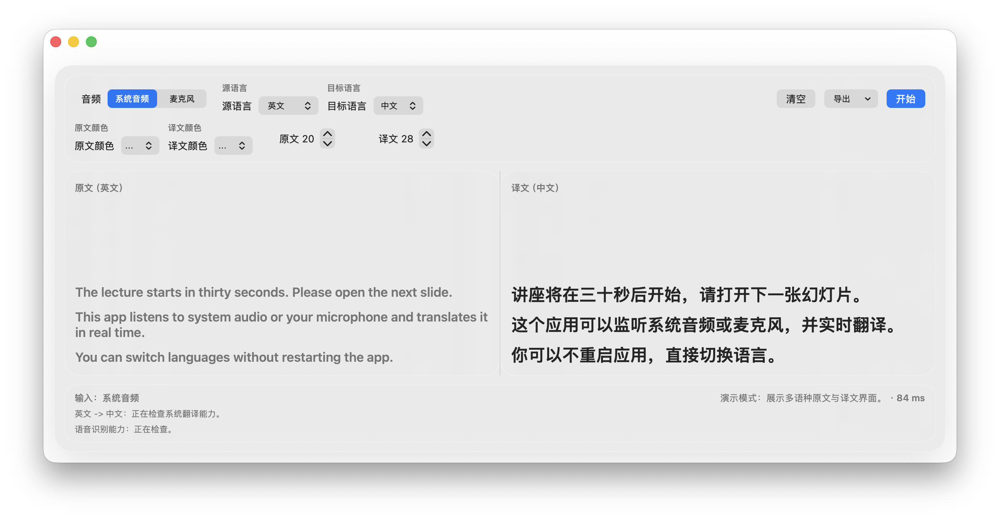
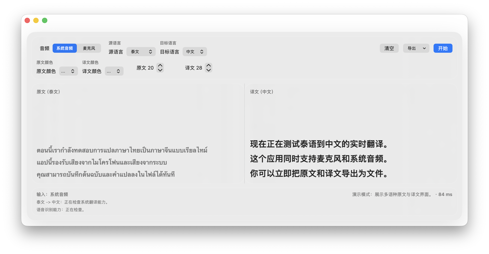
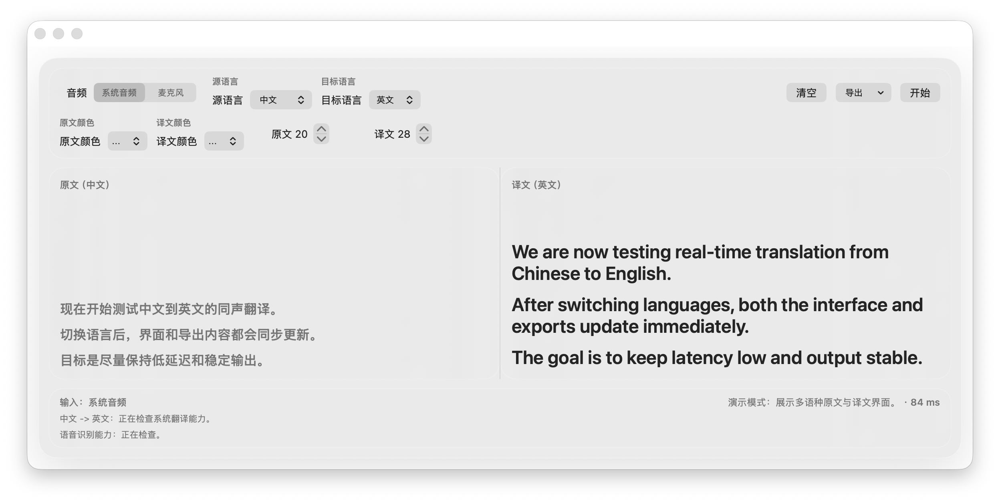

# OfflineInterpreterApp

一个面向 macOS 的开源同声传译字幕框。

它直接复用 Apple 自带的 `Speech.framework`、`Translation.framework`、`AVFoundation` 和 `ScreenCaptureKit`，把系统音频或麦克风输入实时转成双栏字幕，不依赖第三方付费翻译平台界面，也不把大模型打包进应用体积里。



## 为什么做这个项目

很多同声传译工具按时长、按语言包或按席位收费。这个项目的目标很直接：

- 尽量利用 macOS 已有的系统能力，降低额外成本
- 不把语音模型和翻译模型打进安装包，避免应用越来越臃肿
- 提供一个能长期放在屏幕下方使用的实时字幕框
- 用开源方式把可复用的实现细节公开出来，减少重复造轮子

## 主要功能

- 系统音频 / 麦克风双输入切换
- 原文 / 译文双栏滚动字幕
- 中间分栏支持拖拽调整
- 窗口支持自由缩放
- 原文颜色、译文颜色、字号分别可调
- 中文字幕、英文字幕、泰文字幕等多语种互译
- 导出原文与译文为 `Word / TXT / Markdown`
- 优先走系统离线翻译；本机已有语音识别资源时优先本地识别

## 当前默认支持的语言

- 中文
- 英文
- 泰文
- 日文
- 法文
- 德文
- 西班牙文
- 韩文

## 本机能力实测

开发机当前环境：`macOS 26.3 / Xcode 26.3`

| 语言 | 语音识别器 | 本地离线识别 | 系统翻译 |
| --- | --- | --- | --- |
| 中文 | 可用 | 已启用 | 已安装 |
| 英文 | 可用 | 已启用 | 已安装 |
| 泰文 | 可用 | 已启用 | 已安装 |
| 日文 | 可用 | 当前未启用 | 系统支持，可按需安装 |
| 法文 | 可用 | 当前未启用 | 系统支持，可按需安装 |
| 德文 | 可用 | 当前未启用 | 系统支持，可按需安装 |
| 西班牙文 | 可用 | 当前未启用 | 系统支持，可按需安装 |
| 韩文 | 可用 | 当前未启用 | 系统支持，可按需安装 |

说明：

- 这套应用不会把额外语言模型直接打包进程序，所以不会因为补充常用语种而明显增大安装包。
- 对于中文、英文、泰文，当前开发机已验证为本地识别 + 本地翻译。
- 对于日文、法文、德文、西班牙文、韩文，应用已经支持切换；是否能做到“全离线语音识别”取决于当前机器是否已有本地语音识别资源。若没有，程序会自动回退到联网识别，但仍优先使用系统翻译能力。

## 截图

| 英文 -> 中文 | 泰文 -> 中文 | 中文 -> 英文 |
| --- | --- | --- |
|  |  |  |

## 下载与安装

### 方式一：从 Releases 下载

- 仓库地址：[ZH-EN-TH-translate](https://github.com/leoyoyofiona/ZH-EN-TH-translate)
- 推荐下载发布包：`OfflineInterpreterApp-v0.1.0-macOS.zip`
- 解压后直接运行 `OfflineInterpreterApp.app`

如需本地重新生成发布 ZIP：

```bash
./scripts/build_release_zip.sh
```

生成结果默认位于：

```bash
dist/OfflineInterpreterApp-v0.1.0-macOS.zip
```

### 方式二：直接运行源码

```bash
swift build
swift test
swift run OfflineInterpreterChecks
./scripts/open_app.sh --rebuild
```

### 方式三：Xcode 签名运行

如果你要稳定使用“系统音频”模式，优先使用 Xcode 的签名版运行：

1. 打开 `OfflineInterpreterApp.xcodeproj`
2. 选中 `OfflineInterpreterApp` target
3. 在 `Signing & Capabilities` 里选择自己的 `Team`
4. 首次运行后授予：
   - 屏幕录制
   - 语音识别
   - 麦克风

## 使用方式

1. 选择输入源：`系统音频` 或 `麦克风`
2. 选择 `源语言`
3. 选择 `目标语言`
4. 点击 `开始`
5. 需要切换视频或会话时，点击 `清空`
6. 需要保存记录时，点击 `导出`

## 目录结构

- `Sources/OfflineInterpreterKit`：识别、翻译、音频采集、资源检查、导出与播报
- `Sources/OfflineInterpreterApp`：SwiftUI 窗口与双栏字幕 UI
- `Sources/OfflineInterpreterChecks`：基础 smoke checks
- `scripts/open_app.sh`：构建并打开稳定安装在 `~/Applications` 的 app
- `scripts/build_release_zip.sh`：构建 Xcode Release 包并导出 ZIP
- `OfflineInterpreterApp.xcodeproj`：适合 Xcode 正式签名运行的工程

## 已做的速度优化

- 复用 `TranslationSession`，避免每段文本重复预热
- 对重复 partial 结果做去重，减少无效重译
- 对同语言对同原文命中翻译缓存
- 降低麦克风采集缓冲区，缩短识别链路首段等待
- 缩短 partial 和稳定段的翻译 debounce

## 限制

- 当前工程目标系统是 `macOS 26+`
- `Translation.framework` 的能力边界决定了翻译质量上限
- 多数新增语言在不同机器上的“是否离线识别”取决于系统语音资源是否已经就绪
- 系统音频捕捉依赖正确的 app 签名和 `屏幕录制` 权限

## 本地验证

```bash
swift run OfflineInterpreterChecks
```

本次补充语言后，已完成的验证包括：

- 扩展语种后构建通过
- `swift test` 通过
- 语言切换控件可在同一窗口中切换多语种
- 开发机上中文 / 英文 / 泰文支持本地识别与翻译
- 日文 / 法文 / 德文 / 西班牙文 / 韩文已完成系统能力探测与应用内接入

如需重新生成 GitHub 首页截图：

```bash
./scripts/capture_screenshots.sh
```

## 开源说明

这个项目的定位不是“另一个收费翻译 SaaS 的皮肤层”，而是一个可复用的本地同传实现：

- 代码公开
- 不锁平台账号
- 不强制订阅
- 尽量复用系统自带能力，减少用户额外成本

如果你也在做本地字幕、会议转写、课堂翻译或外语视频辅助阅读，可以直接在这个项目上继续扩展。
