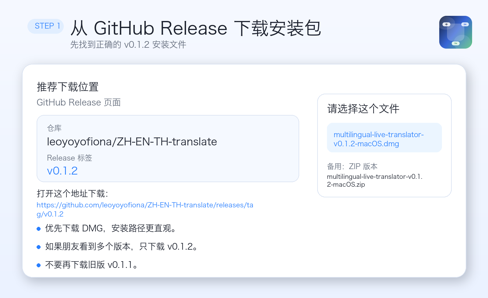
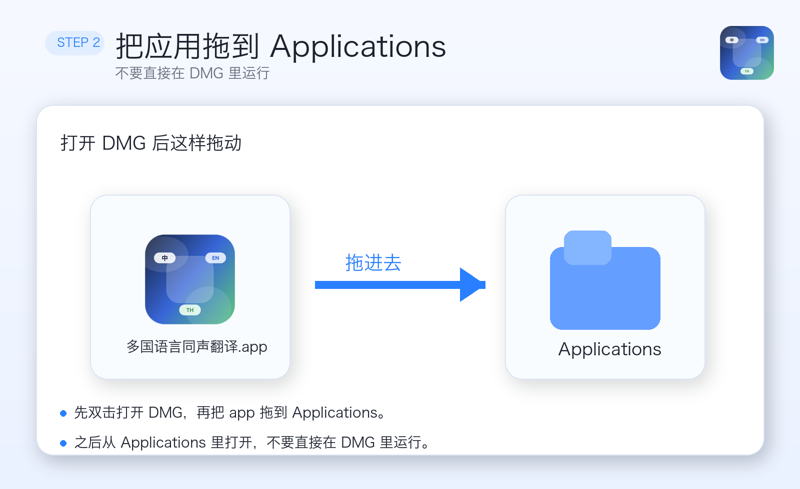
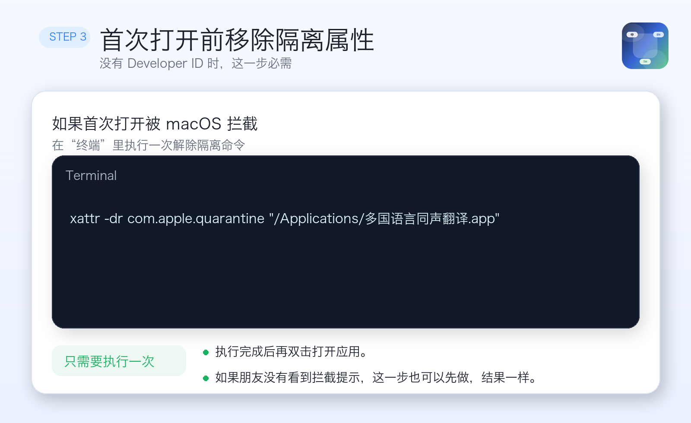
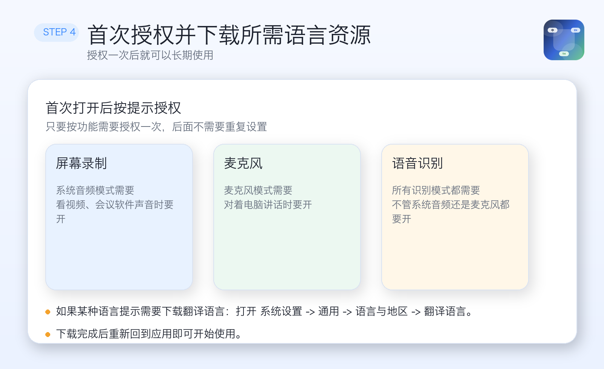

# 多国语言同声翻译安装指南

这份指南是给普通用户的，不需要 Xcode，不需要开发环境。

适用版本：`v0.1.2`

下载地址：
- [Release 页面](https://github.com/leoyoyofiona/ZH-EN-TH-translate/releases/tag/v0.1.2)
- [DMG 直接下载](https://github.com/leoyoyofiona/ZH-EN-TH-translate/releases/download/v0.1.2/multilingual-live-translator-v0.1.2-macOS.dmg)
- [ZIP 直接下载](https://github.com/leoyoyofiona/ZH-EN-TH-translate/releases/download/v0.1.2/multilingual-live-translator-v0.1.2-macOS.zip)

## 安装前先知道

- 当前最低系统版本：`macOS 26+`
- 现在仓库里提供的是“社区版”安装包
- 因为当前没有 `Developer ID Application` 和苹果公证，首次打开前需要执行一次终端命令
- 这不是程序损坏，而是 macOS 对未公证应用的默认拦截

## 第 1 步：下载正确的安装包

请选择 `v0.1.2`，优先下载 `DMG`：



要下载的文件名是：

```text
multilingual-live-translator-v0.1.2-macOS.dmg
```

不要再下载旧版 `v0.1.1`。

## 第 2 步：把应用拖到 Applications

下载完成后：
1. 双击打开 `DMG`
2. 把 `多国语言同声翻译.app` 拖到 `Applications`
3. 后续从 `Applications` 打开，不要直接在 `DMG` 里运行



## 第 3 步：首次打开前执行一次终端命令

如果你没有 Apple Developer ID 信任链，这一步必须做一次：



打开“终端”，执行：

```bash
xattr -dr com.apple.quarantine "/Applications/多国语言同声翻译.app"
```

执行完后，再双击应用。

## 第 4 步：首次授权

应用第一次启动时，请按功能需要授权：

- `屏幕录制`：系统音频模式需要
- `麦克风`：麦克风模式需要
- `语音识别`：所有识别模式都需要



如果某种语言提示需要下载翻译资源：

```text
系统设置 -> 通用 -> 语言与地区 -> 翻译语言
```

下载完成后回到应用即可。

## 常见问题

### 1. 为什么会被系统拦截？
因为当前发布的是社区版，没有苹果公证。执行一次 `xattr -dr com.apple.quarantine ...` 后就可以正常打开。

### 2. 看到“已损坏，无法打开”怎么办？
先确认下载的是 `v0.1.2`，然后执行上面的终端命令。旧版 `v0.1.1` 的确有坏包问题，不要再用。

### 3. 朋友不会用终端怎么办？
把这条命令直接发给他复制粘贴即可：

```bash
xattr -dr com.apple.quarantine "/Applications/多国语言同声翻译.app"
```

### 4. 授权已经开了，还是不能用系统音频？
请确认：
1. 应用是从 `Applications` 打开的
2. 权限是给 `多国语言同声翻译.app` 当前这份安装包开的
3. 开完权限后完全退出应用，再重新打开一次

## 给朋友的最短版说明

1. 下载 `multilingual-live-translator-v0.1.2-macOS.dmg`
2. 拖 `多国语言同声翻译.app` 到 `Applications`
3. 打开终端执行：

```bash
xattr -dr com.apple.quarantine "/Applications/多国语言同声翻译.app"
```

4. 再打开应用并按提示授权
